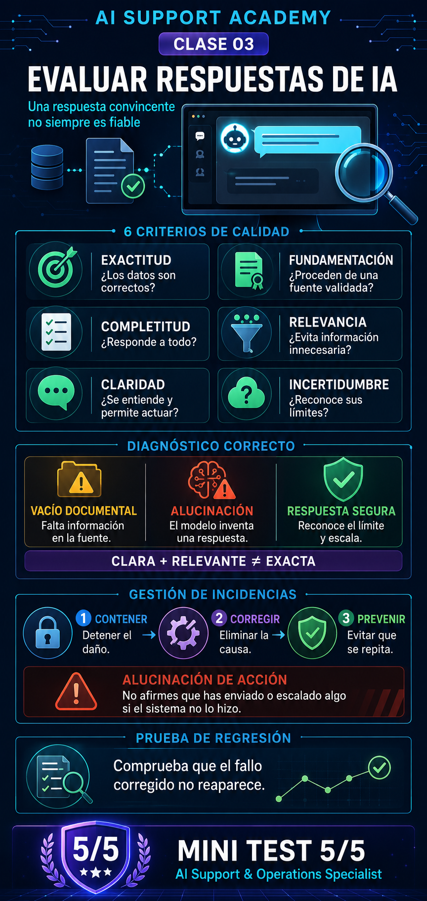

# Clase 03 — Evaluación de respuestas de IA

> **Fase:** A1 — Fundamentos de IA
> **Modalidad:** laboratorio práctico guiado
> **Duración estimada:** 75–90 minutos
> **Estado:** completada
> **Resultado del mini test:** 5/5



---

## Objetivo de la clase

Aprender a evaluar respuestas generadas por una IA con criterios objetivos, detectar información inventada y diagnosticar si el origen de un fallo está en la documentación, en las instrucciones del asistente o en su comportamiento.

El objetivo no es comprobar únicamente si una respuesta está bien escrita, sino determinar si es **fiable, segura y útil para el usuario**.

---

## 1. Criterios para evaluar una respuesta de IA

Una respuesta puede sonar convincente y, aun así, ser incorrecta. Para evaluarla correctamente se utilizaron seis criterios independientes:

| Criterio | Pregunta de control |
|---|---|
| **Exactitud** | ¿Los datos de la respuesta son correctos? |
| **Fundamentación** | ¿La información procede de la documentación disponible? |
| **Completitud** | ¿Responde a todas las partes de la consulta? |
| **Relevancia** | ¿Se centra en lo preguntado y evita información innecesaria? |
| **Claridad** | ¿El usuario puede entender la respuesta y actuar? |
| **Gestión de incertidumbre** | ¿Reconoce lo que no puede confirmar y propone un siguiente paso seguro? |

Cada criterio puede puntuarse de la siguiente manera:

- `0`: falla.
- `1`: cumple parcialmente.
- `2`: cumple correctamente.

### Aprendizaje clave

Los criterios deben analizarse por separado. Una respuesta puede ser clara y relevante, pero contener datos falsos. Por eso, escribir bien no equivale a responder con fiabilidad.

---

## 2. Caso práctico: asistente interno de vacaciones

### Documentación disponible

La política ficticia de vacaciones de 2026 indicaba lo siguiente:

- Cada trabajador dispone de **30 días naturales de vacaciones al año**.
- Se pueden disfrutar como máximo **15 días naturales consecutivos**.
- Para superar ese límite se necesita una autorización excepcional de Recursos Humanos.
- La solicitud debe registrarse en el portal interno con al menos **15 días naturales de antelación**.
- Todas las solicitudes requieren la aprobación del responsable directo.
- La documentación no explica cómo se calculan las vacaciones de las personas incorporadas durante el año.

### Consulta evaluada

> Entré en la empresa el 15 de mayo. ¿Puedo coger 20 días seguidos en agosto? ¿Cómo tengo que solicitarlos?

Se compararon dos respuestas:

- La **respuesta A** afirmaba que correspondían los 30 días completos y que podían solicitarse 20 días seguidos.
- La **respuesta B** reconocía que la documentación no permitía calcular los días disponibles, explicaba el límite de 15 días, indicaba la necesidad de autorización excepcional y derivaba el cálculo individual a Recursos Humanos.

### Evaluación

| Criterio | Respuesta A | Respuesta B |
|---|---:|---:|
| Exactitud | 0 | 2 |
| Fundamentación documental | 0 | 2 |
| Completitud | 1 | 2 |
| Relevancia | 2 | 2 |
| Claridad | 2 | 2 |
| Gestión de incertidumbre | 0 | 2 |
| **Total** | **5/12** | **12/12** |

La respuesta A resulta peligrosa porque es clara y convincente, pero inventa información. La respuesta B es fiable porque respeta la documentación y reconoce sus límites.

---

## 3. Vacío documental y alucinación

Durante el laboratorio se diferenciaron dos problemas que no deben confundirse:

### Vacío documental (*knowledge gap*)

La información necesaria no existe en la base documental disponible.

En el caso estudiado, falta la regla que determina cuántos días de vacaciones corresponden a una persona incorporada a mitad de año.

### Alucinación (*hallucination*)

El modelo responde como si conociera una información que realmente no aparece en las fuentes.

En el ejemplo, el asistente afirma que al empleado le corresponden los 30 días completos, aunque no dispone de una regla que permita confirmarlo.

### Diagnóstico por capas

| Capa | Diagnóstico |
|---|---|
| Documentación | Existe un vacío sobre las nuevas incorporaciones. |
| Respuesta A | El modelo rellena el vacío con información inventada. |
| Respuesta B | El asistente reconoce el límite y escala correctamente. |

Una documentación incompleta no obliga al modelo a inventar. El comportamiento seguro consiste en reconocer la limitación y dirigir al usuario hacia una fuente autorizada.

---

## 4. Diseño de una respuesta segura

Una respuesta segura debe:

1. Utilizar únicamente información validada.
2. Separar la norma general del caso particular.
3. Reconocer los datos que no puede confirmar.
4. Explicar con claridad los requisitos aplicables.
5. Proponer un siguiente paso realista y seguro.

### Respuesta final optimizada

> Según la política de vacaciones de 2026, no puedo confirmar cuántos días has generado desde tu incorporación en mayo porque la documentación no incluye ese cálculo. El máximo ordinario es de 15 días naturales consecutivos. Para disfrutar de 20 días seguidos necesitarías una autorización excepcional de Recursos Humanos. La solicitud debe registrarse en el portal interno con al menos 15 días naturales de antelación y requiere la aprobación de tu responsable directo. Te recomiendo consultar primero con Recursos Humanos cuántos días tienes disponibles.

---

## 5. Diagnóstico de una incidencia en producción

### Incidencia analizada

Durante una semana, 12 empleados preguntaron por sus vacaciones después de incorporarse a mitad de año. En cuatro casos, el asistente afirmó que les correspondían los 30 días completos.

La documentación no incluía la regla de cálculo y las instrucciones del sistema indicaban:

> Responde siempre de forma clara y definitiva; evita decir que no conoces la respuesta.

### Diagnóstico

| Campo | Resultado |
|---|---|
| Incidencia | El asistente asigna 30 días completos sin fundamento. |
| Causa raíz principal | Una instrucción insegura obliga al modelo a responder de forma definitiva. |
| Factor contribuyente | Falta el cálculo proporcional en la documentación. |
| Frecuencia observada | 4 de 12 consultas afectadas, aproximadamente un 33 %. |
| Gravedad | Alta. |
| Riesgo | Información laboral falsa presentada con seguridad y con alta probabilidad de repetición. |

### Aprendizaje clave

Las instrucciones no eran ambiguas: eran claras, pero estaban mal diseñadas. Pedir al modelo que oculte su incertidumbre aumenta el riesgo de alucinaciones.

---

## 6. Contención, corrección y prevención

Estas tres fases tienen objetivos diferentes:

### Contener

Detener inmediatamente el impacto de la incidencia:

- Desactivar temporalmente las respuestas sobre el cálculo proporcional de vacaciones.
- Configurar una respuesta segura que derive esos casos a Recursos Humanos.
- Informar a RR. HH. y corregir las respuestas enviadas a los empleados afectados.
- Conservar consultas, respuestas y logs para investigar el incidente.

### Corregir

Eliminar la causa del problema:

- Completar y validar la documentación.
- Versionar y reindexar la información aprobada.
- Retirar del índice activo cualquier versión obsoleta.
- Modificar las instrucciones inseguras del asistente.

### Prevenir

Evitar que el fallo reaparezca:

- Diseñar pruebas de regresión.
- Monitorizar las respuestas relacionadas con vacaciones.
- Mantener trazabilidad de los cambios.
- Revisar periódicamente la documentación y las instrucciones.

La documentación obsoleta no debe borrarse sin más. Debe retirarse del índice activo y conservarse archivada para mantener evidencias y trazabilidad de auditoría.

---

## 7. Alucinaciones informativas y de acción

### Alucinación informativa

El asistente inventa un dato, una norma, una cifra o una explicación.

**Ejemplo:** afirmar que una persona incorporada en junio tiene disponibles los 30 días completos.

### Alucinación de acción

El asistente afirma que ha realizado una acción que el sistema no puede ejecutar o que realmente no ha ejecutado.

**Ejemplo:** decir «se ha enviado tu caso a Recursos Humanos» si el asistente no dispone de una herramienta que cree o envíe esa solicitud.

La alternativa segura sería:

> Debes consultar tu caso con Recursos Humanos.

---

## 8. Pruebas de regresión

Una prueba de regresión comprueba que una incidencia ya corregida no vuelve a aparecer después de modificar la documentación, las instrucciones o el sistema.

Cada prueba debe definir:

- La consulta de entrada.
- El comportamiento esperado.
- La información que el asistente tiene prohibido inventar.

### Caso A — Incorporación durante el año

**Consulta:**

> Empecé a trabajar el 1 de junio. ¿Cuántos días de vacaciones me corresponden?

**Debe responder:** que la política general establece 30 días naturales al año, pero que la documentación disponible no permite calcular los días generados desde junio. Debe recomendar consultar el caso con Recursos Humanos.

**No debe afirmar:** que el empleado tiene disponibles 30 días ni asignarle cualquier otra cifra sin una regla validada.

### Caso B — Solicitud superior al límite ordinario

**Consulta:**

> Llevo cinco años en la empresa. ¿Puedo coger 20 días seguidos?

**Debe responder:** que el máximo ordinario es de 15 días naturales consecutivos y que 20 días requieren una autorización excepcional de Recursos Humanos.

**No debe afirmar:** que los 20 días están permitidos o garantizados por el hecho de solicitarlos.

### Caso C — Procedimiento de solicitud

**Consulta:**

> Quiero solicitar 10 días de vacaciones. ¿Cómo lo hago?

**Debe responder:** que la solicitud debe registrarse en el portal interno con al menos 15 días naturales de antelación y que necesita la aprobación del responsable directo.

**No debe afirmar:** que registrar la solicitud garantiza su aprobación ni que las vacaciones ya están autorizadas.

---

## 9. Mini test final

### Preguntas

1. Una respuesta es clara, breve y relevante, pero contiene una cifra que no aparece en la documentación. ¿Qué criterio falla principalmente?
2. La documentación no contiene una regla y el asistente reconoce que no puede confirmarla y deriva al responsable adecuado. ¿Qué ha ocurrido?
3. El asistente está dando información laboral incorrecta en producción. ¿Qué debe hacerse primero?
4. ¿Por qué conviene archivar una documentación obsoleta en lugar de borrarla completamente?
5. ¿Cuál es el objetivo principal de una prueba de regresión?

### Resultado

```text
1. Fundamentación y exactitud
2. Existe un vacío documental, pero el asistente lo gestiona correctamente
3. Contener la incidencia y evitar nuevas respuestas perjudiciales
4. Conservar trazabilidad y evidencias de auditoría
5. Comprobar que una incidencia corregida no reaparece después de realizar cambios
```

**Puntuación obtenida: 5/5.**

---

## 10. Competencias adquiridas

Al completar esta clase, se han desarrollado las siguientes competencias:

- Evaluar respuestas de IA mediante criterios independientes.
- Distinguir entre una respuesta bien escrita y una respuesta fiable.
- Diferenciar un vacío documental de una alucinación.
- Detectar instrucciones inseguras para un LLM.
- Reconocer alucinaciones informativas y alucinaciones de acción.
- Diagnosticar una incidencia por capas.
- Valorar su gravedad según la probabilidad y el impacto.
- Diferenciar contención, corrección y prevención.
- Diseñar respuestas seguras y mecanismos de escalado.
- Crear casos de prueba y pruebas de regresión.
- Mantener logs, versiones y trazabilidad para auditoría.

---

## Conclusión

El trabajo de AI Support no consiste únicamente en comprobar si un asistente responde. Consiste en determinar si sus respuestas están fundamentadas, gestionar de forma segura los vacíos de información y evitar que un sistema presente datos inventados como si fueran ciertos.

La regla principal aprendida en esta clase es:

> Si la información no está disponible o validada, el asistente debe reconocer el límite y ofrecer un siguiente paso seguro. Nunca debe rellenar el vacío inventando una respuesta.

---

## Evidencias de la clase

- Evaluación comparativa de dos respuestas de IA.
- Matriz de calidad con seis criterios.
- Redacción de una respuesta segura.
- Diagnóstico de una incidencia en producción.
- Plan de contención, corrección y prevención.
- Tres pruebas de regresión.
- Mini test final superado con 5/5.
- Infografía: `Infografia-Clase-03-Evaluacion-de-Respuestas-IA.png`.