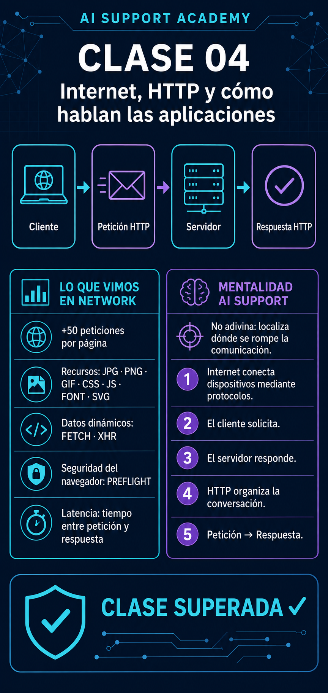

# 🤖 AI Support Academy

# Clase 04 — Internet, HTTP y cómo hablan las aplicaciones

**Fase:** A2 — HTTP, APIs y JSON  
**Duración estimada:** 2–3 horas  
**Nivel:** Principiante  
**Estado:** Completada ✅

---

## Objetivo de la clase

Comprender cómo se comunican las aplicaciones a través de Internet y conocer los elementos básicos de una comunicación HTTP.

Al finalizar esta clase seré capaz de:

- Explicar la diferencia entre cliente y servidor.
- Entender el patrón petición–respuesta.
- Describir para qué sirve HTTP.
- Observar tráfico HTTP desde el navegador.
- Reconocer algunos recursos web habituales.
- Aplicar una mentalidad inicial de diagnóstico técnico.

---

## 1. ¿Qué ocurre cuando usamos una aplicación?

Cuando abrimos una página web, reproducimos una canción o enviamos un mensaje a ChatGPT, nuestro dispositivo necesita comunicarse con otros sistemas.

Por ejemplo, al enviar un mensaje a una aplicación de IA ocurre un proceso parecido al siguiente:

```text
Usuario
   │
   │ Escribe un mensaje
   ▼
Cliente: navegador o aplicación
   │
   │ Envía una petición
   ▼
Internet
   │
   ▼
Servidor
   │
   │ Procesa la petición
   ▼
Sistema o modelo de IA
   │
   │ Genera un resultado
   ▼
Servidor
   │
   │ Devuelve una respuesta
   ▼
Cliente
   │
   ▼
El usuario ve la respuesta
```

Aunque para el usuario parece una única acción, detrás se producen varias operaciones en muy poco tiempo.

---

## 2. ¿Qué es Internet?

Internet es una red mundial formada por millones de dispositivos conectados entre sí.

Estos dispositivos pueden comunicarse porque utilizan unas reglas comunes llamadas **protocolos**.

Un protocolo establece cómo debe realizarse una comunicación para que los sistemas puedan entenderse.

Internet está formado por numerosos elementos:

- Ordenadores.
- Servidores.
- Routers.
- Centros de datos.
- Redes móviles.
- Redes inalámbricas.
- Cables terrestres y submarinos.
- Protocolos de comunicación.

Internet no es una única máquina y tampoco es magia. Es una gran infraestructura que permite intercambiar información entre dispositivos.

---

## 3. Cliente y servidor

La comunicación de muchas aplicaciones se basa en dos elementos principales: el cliente y el servidor.

### Cliente

El **cliente** es el programa o dispositivo que solicita información o pide que se realice una acción.

Algunos ejemplos de clientes son:

- Un navegador web.
- Una aplicación móvil.
- Spotify.
- ChatGPT Desktop.
- Postman.
- Un programa que consulta una API.

Cuando abrimos una web, el navegador actúa como cliente.

### Servidor

El **servidor** es el sistema que recibe una petición, la procesa y devuelve una respuesta.

Un servidor puede:

- Entregar una página web.
- Enviar una imagen.
- Devolver datos.
- Validar un usuario.
- Guardar información.
- Procesar una consulta dirigida a un modelo de IA.

### Relación cliente–servidor

El flujo básico es:

```text
Cliente
   │
   │ Petición
   ▼
Servidor
   │
   │ Respuesta
   ▼
Cliente
```

El cliente solicita algo y el servidor responde con el resultado.

---

## 4. Ejemplos cotidianos

### Abrir una página web

```text
Navegador → Solicita la página → Servidor web
Navegador ← Recibe el contenido ← Servidor web
```

### Reproducir una canción

```text
Aplicación → Solicita la canción → Servidor
Aplicación ← Recibe el audio ← Servidor
```

### Consultar una cuenta bancaria

```text
Aplicación → Solicita el saldo → Servidor del banco
Aplicación ← Recibe los datos autorizados ← Servidor del banco
```

### Enviar un mensaje a una IA

```text
Aplicación → Envía el mensaje → Servidor
Aplicación ← Recibe la respuesta generada ← Servidor
```

Aunque estas aplicaciones realizan tareas diferentes, todas necesitan intercambiar información.

---

## 5. ¿Qué es HTTP?

HTTP significa:

> **Hypertext Transfer Protocol**

HTTP es uno de los protocolos utilizados para intercambiar información entre clientes y servidores.

Una definición sencilla es:

> HTTP organiza la comunicación entre un cliente y un servidor mediante peticiones y respuestas.

HTTP permite que el cliente indique qué necesita y que el servidor comunique el resultado.

---

## 6. Petición y respuesta

Una comunicación HTTP básica sigue este patrón:

```text
PETICIÓN
   ↓
RESPUESTA
```

### Petición

La petición representa lo que el cliente quiere solicitar o realizar.

Ejemplo conceptual:

```text
Cliente:

Quiero consultar esta página.
```

### Respuesta

La respuesta contiene el resultado devuelto por el servidor.

Ejemplo conceptual:

```text
Servidor:

Petición procesada.
Aquí tienes la página.
```

La respuesta puede contener:

- Una página web.
- Datos.
- Una imagen.
- Un archivo.
- Un mensaje de confirmación.
- Información sobre un error.

En las siguientes clases se estudiará cómo están construidas las peticiones y las respuestas HTTP.

---

## 7. HTTP y HTTPS

HTTP permite intercambiar información entre clientes y servidores.

HTTPS realiza ese intercambio utilizando una conexión protegida mediante cifrado.

La letra `S` significa:

> **Secure**

Podemos reconocerlos al principio de una dirección web:

```text
http://ejemplo.com
https://ejemplo.com
```

HTTPS ayuda a proteger la información enviada y recibida, por lo que es especialmente importante cuando se transmiten:

- Contraseñas.
- Datos personales.
- Tokens.
- Claves API.
- Información bancaria.

La idea principal que debo recordar es:

> HTTPS es la versión segura de la comunicación HTTP.

---

## 8. Una página web realiza muchas peticiones

Cuando abrimos una página, puede parecer que el navegador recibe toda la web de una sola vez.

En realidad, una página suele necesitar numerosas peticiones independientes.

El navegador puede solicitar:

- El documento HTML.
- Los estilos CSS.
- El código JavaScript.
- Las imágenes.
- Los iconos.
- Las fuentes.
- Los vídeos.
- Los datos que necesita la aplicación.

Un ejemplo simplificado sería:

```text
GET /pagina.html
GET /estilos.css
GET /aplicacion.js
GET /logo.png
GET /fuente.woff2
```

No es necesario comprender todavía el significado exacto de `GET`. Se estudiará en las próximas clases.

Lo importante es entender que cada línea representa una solicitud diferente.

Por esta razón, una página puede generar decenas o incluso cientos de peticiones.

---

## 9. La pestaña Network

Los navegadores incluyen herramientas de desarrollo que permiten observar cómo funciona una página.

Normalmente se pueden abrir pulsando:

```text
F12
```

Dentro de estas herramientas se encuentra la pestaña:

> **Network** o **Red**

Esta pestaña muestra las solicitudes realizadas mientras utilizamos una web.

Permite observar información como:

- El recurso solicitado.
- El tipo de recurso.
- El resultado de la petición.
- El tamaño de la respuesta.
- El tiempo necesario para recibirla.

Network es una herramienta muy importante para soporte porque permite observar evidencias reales sobre la comunicación entre el navegador y los servidores.

---

## 10. Recursos observados

Durante el laboratorio aparecieron distintos tipos de recursos.

### Recursos reconocidos

#### JPG, PNG y GIF

Son formatos de imagen:

```text
.jpg
.png
.gif
```

#### CSS

Contiene los estilos visuales de la página.

Controla elementos como:

- Colores.
- Tamaños.
- Márgenes.
- Tipografías.
- Posiciones.

#### Script

Normalmente representa código JavaScript ejecutado por el navegador.

JavaScript permite añadir comportamiento e interactividad a una página.

#### Font

Representa los archivos de las fuentes tipográficas utilizadas por la web.

### Recursos o conceptos nuevos

También aparecieron elementos que todavía no eran conocidos:

- SVG.
- Fetch.
- XHR.
- Preflight.

#### SVG

Es un formato gráfico utilizado habitualmente para iconos, logotipos e ilustraciones.

#### Fetch y XHR

Suelen aparecer cuando JavaScript solicita información al servidor sin recargar toda la página.

Por ejemplo:

```text
El usuario pulsa «Ver tickets»
             ↓
La aplicación solicita los datos
             ↓
El servidor devuelve los tickets
             ↓
La pantalla se actualiza
```

Estas solicitudes serán importantes en las próximas clases porque muchas representan comunicaciones con APIs.

#### Preflight

Es una comprobación de seguridad que el navegador puede realizar antes de permitir determinadas peticiones.

Está relacionada con un mecanismo llamado **CORS**.

No es necesario comprenderlo completamente en esta clase. Por ahora, solo hay que recordar que:

- Es una comprobación previa.
- La realiza el navegador.
- Está relacionada con la seguridad.
- Puede aparecer en la pestaña Network.

---

## 11. Latencia

La **latencia** es el tiempo que transcurre entre el envío de una petición y la recepción de su respuesta.

```text
Petición
   │
   │────── Tiempo de espera ──────►
   │
Respuesta
```

Una petición puede funcionar y, aun así, tardar demasiado.

Por ejemplo:

```text
Tiempo habitual: 300 milisegundos
Tiempo durante una incidencia: 8 segundos
```

En los dos casos el servidor podría responder, pero el segundo representa un posible problema de rendimiento.

Por eso, al diagnosticar una aplicación no solo debemos comprobar si responde.

También debemos observar cuánto tarda.

---

## 12. Importancia para AI Support

Cuando un usuario dice:

> La IA no funciona.

El problema real podría encontrarse en distintos puntos:

- El dispositivo no tiene conexión.
- La petición no se envía.
- El servidor no está disponible.
- La respuesta tarda demasiado.
- La autenticación falla.
- La petición contiene datos incorrectos.
- El servidor devuelve un error.

Un profesional de AI Support no debe adivinar el problema.

Debe intentar localizar dónde se rompe o se degrada la comunicación.

Un análisis inicial podría seguir este orden:

```text
¿Existe conexión?
        ↓
¿Se envía la petición?
        ↓
¿Llega una respuesta?
        ↓
¿La respuesta indica un error?
        ↓
¿Cuánto ha tardado?
```

Esta forma de pensar transforma una descripción general:

> No funciona.

en una pregunta técnica:

> ¿En qué punto falla la comunicación?

---

## 13. Test de conocimientos

### Pregunta 1

Cuando escribimos un mensaje en una aplicación web, ¿quién inicia normalmente la comunicación?

- A) El servidor.
- B) El cliente.
- C) Internet.

**Respuesta:** B ✅

### Pregunta 2

¿Quién procesa la petición y devuelve la respuesta?

- A) El cliente.
- B) El servidor.
- C) El navegador.

**Respuesta:** B ✅

### Pregunta 3

¿Para qué sirve HTTP?

- A) Para crear páginas web.
- B) Para organizar la comunicación entre clientes y servidores.
- C) Para crear inteligencia artificial.

**Respuesta:** B ✅

### Pregunta 4

¿Qué ocurre primero en una comunicación HTTP normal?

- A) La respuesta.
- B) La petición.

**Respuesta:** B ✅

### Pregunta 5

¿Qué intenta averiguar un profesional de AI Support?

- A) Quién tiene la culpa.
- B) Dónde falla la comunicación.
- C) Qué ordenador es más rápido.

**Respuesta:** B ✅

### Resultado

```text
5/5 respuestas correctas
```

**Test superado ✅**

---

## 14. Laboratorio práctico

### Objetivo

Observar comunicaciones reales entre el navegador y diferentes servidores.

### Procedimiento

1. Abrir el navegador.
2. Acceder a una página web.
3. Pulsar `F12`.
4. Abrir la pestaña **Network**.
5. Recargar la página con `F5`.
6. Observar las solicitudes.
7. Navegar por diferentes enlaces.
8. Identificar los recursos conocidos.
9. Anotar los elementos desconocidos.
10. Observar el tiempo necesario para cargar la información.

---

## 15. Resultado del laboratorio

### Peticiones observadas

Se observaron:

> Más de 50 peticiones por cada página o enlace visitado.

Esto demuestra que una web no se obtiene mediante una única petición.

El navegador solicita numerosos archivos y datos de forma independiente.

### Recursos reconocidos

- JPG.
- PNG.
- GIF.
- CSS.
- Scripts.
- Fuentes.

### Elementos nuevos

- SVG.
- Fetch.
- XHR.
- Preflight.
- Otros recursos y solicitudes todavía desconocidos.

### Lo que más llamó la atención

Lo más sorprendente fue la velocidad con la que se cargó toda la información.

El navegador fue capaz de:

- Enviar numerosas peticiones.
- Recibir las respuestas.
- Descargar imágenes, fuentes, estilos y scripts.
- Construir la página.
- Mostrar el resultado.

Todo esto ocurrió en muy poco tiempo.

Esta observación permitió comprender por primera vez la importancia de la latencia.

---

## 16. Lo que debo recordar

Las cinco ideas principales de esta clase son:

1. **Internet conecta dispositivos mediante protocolos.**
2. **El cliente solicita y el servidor responde.**
3. **HTTP organiza la comunicación mediante peticiones y respuestas.**
4. **Una página web puede realizar decenas o cientos de peticiones.**
5. **Un profesional de AI Support analiza dónde falla la comunicación.**

---

## 17. Evidencia visual



---

## 18. Competencias adquiridas

Después de completar esta clase puedo:

- Explicar la diferencia entre cliente y servidor.
- Describir el patrón petición–respuesta.
- Explicar la función básica de HTTP.
- Diferenciar HTTP y HTTPS a nivel inicial.
- Utilizar la pestaña Network del navegador.
- Reconocer recursos web habituales.
- Identificar los términos Fetch, XHR y Preflight.
- Comprender el concepto inicial de latencia.
- Empezar a diagnosticar una comunicación mediante evidencias.

---

## 19. Estado final

```text
Clase 04: completada
Test: 5/5
Laboratorio Network: completado
Infografía: creada
```

### Clase 04 superada ✅

---

## 20. Próximo paso

### Clase 05 — APIs REST: cómo las aplicaciones piden y modifican datos

En la siguiente clase aprenderé:

- Qué es una API.
- Qué significa REST.
- Qué son los recursos y los endpoints.
- Cómo las aplicaciones solicitan datos.
- Cómo las aplicaciones crean, modifican y eliminan información.
- Para qué sirven los principales métodos HTTP.