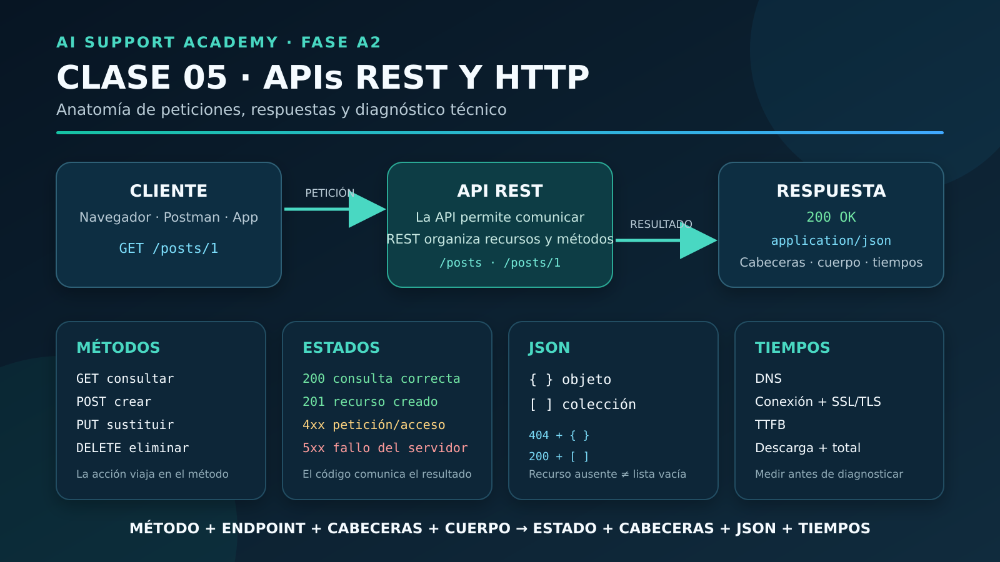

# 🤖 AI Support Academy

# Clase 05 — APIs REST: anatomía de peticiones y respuestas HTTP

**Fase:** A2 — HTTP, APIs y JSON
**Duración estimada:** 2–3 horas
**Nivel:** Principiante
**Estado:** Completada ✅

---

## Objetivo de la clase

Comprender cómo una API organizada con estilo REST utiliza HTTP para consultar, crear, modificar y eliminar recursos, y aprender a examinar una petición y su respuesta con evidencias reales del navegador.

Al finalizar esta clase seré capaz de:

- Explicar qué es una API.
- Diferenciar una API del estilo REST.
- Reconocer recursos, identificadores y endpoints.
- Relacionar los métodos HTTP con la operación que representan.
- Interpretar códigos de estado habituales.
- Distinguir cabeceras de petición y de respuesta.
- Diferenciar objetos y arrays JSON.
- Analizar tiempos de DNS, conexión, SSL, TTFB y descarga.
- Formular un diagnóstico técnico inicial sin confundir una respuesta de error con una caída completa del servicio.

---

## 1. De HTTP a las APIs

En la Clase 04 aprendí que un cliente envía una petición y un servidor devuelve una respuesta.

En esta clase utilicé ese modelo para comunicarme con una API real de pruebas:

```text
Cliente: navegador
        │
        │ Petición HTTP
        ▼
API de JSONPlaceholder
        │
        │ Respuesta HTTP + JSON
        ▼
Cliente
```

La API recibió peticiones, localizó recursos y devolvió resultados estructurados.

---

## 2. ¿Qué es una API?

API significa:

> **Application Programming Interface**

Una API es un contrato que permite que dos aplicaciones se comuniquen.

El contrato indica:

- Qué recursos están disponibles.
- Qué endpoints se pueden utilizar.
- Qué métodos admite cada endpoint.
- Qué datos debe enviar el cliente.
- Qué cabeceras son necesarias.
- Qué formato tienen las respuestas.
- Qué errores pueden producirse.

Una aplicación no necesita conocer el funcionamiento interno del servidor. Solo necesita respetar el contrato de la API.

---

## 3. API y REST no son lo mismo

Una API permite la comunicación entre aplicaciones.

REST es una forma de organizar esa comunicación.

> **La API permite la comunicación; REST propone cómo organizarla.**

Dos diseños podrían permitir eliminar el mismo ticket:

```text
POST /eliminarTicket
Body: {"id": 25}
```

```text
DELETE /tickets/25
```

Las dos opciones pueden pertenecer a una API. La segunda sigue mejor el estilo REST porque:

- `DELETE` expresa la acción.
- `/tickets/25` identifica el recurso.
- La URL utiliza un sustantivo en lugar de incluir la acción `eliminar`.

Por tanto:

```text
Todas las APIs REST son APIs.
No todas las APIs tienen que seguir REST.
```

---

## 4. Recursos, identificadores y endpoints

En esta petición:

```text
GET https://jsonplaceholder.typicode.com/posts/5
```

puedo identificar:

- **Método:** `GET`.
- **Servidor o host:** `jsonplaceholder.typicode.com`.
- **Endpoint o ruta:** `/posts/5`.
- **Colección:** `/posts`.
- **Identificador:** `5`.
- **Recurso:** la publicación número 5.

El identificador no es el recurso completo. Es el valor que permite localizar un recurso concreto dentro de una colección.

---

## 5. Anatomía de una petición HTTP

Una petición HTTP puede contener:

```text
MÉTODO + URL + CABECERAS + CUERPO OPCIONAL
```

Ejemplo conceptual:

```http
POST /posts
Content-Type: application/json

{
  "title": "Prueba",
  "body": "Contenido",
  "userId": 1
}
```

- El método indica qué operación se solicita.
- La URL identifica el destino y el recurso.
- Las cabeceras añaden información sobre la petición.
- El cuerpo contiene los datos enviados cuando la operación lo necesita.

---

## 6. Anatomía de una respuesta HTTP

Una respuesta puede contener:

```text
CÓDIGO DE ESTADO + CABECERAS + CUERPO + TIEMPOS
```

Ejemplo observado:

```text
GET /posts/1
200 OK
Content-Type: application/json; charset=utf-8
```

El cuerpo contenía:

```json
{
  "userId": 1,
  "id": 1,
  "title": "...",
  "body": "..."
}
```

---

## 7. Métodos HTTP principales

Los métodos expresan la intención de la petición.

| Método | Operación habitual | Ejemplo |
|---|---|---|
| `GET` | Consultar | `GET /posts/5` |
| `POST` | Crear | `POST /posts` |
| `PUT` | Sustituir un recurso completo | `PUT /posts/5` |
| `DELETE` | Eliminar | `DELETE /posts/5` |

La fórmula que debo recordar es:

> **Método = qué quiero hacer · URL = sobre qué recurso · código HTTP = qué resultado tuvo**

---

## 8. Familias de códigos HTTP

Los códigos se agrupan por familias:

| Familia | Significado general |
|---|---|
| `2xx` | Operación procesada con éxito |
| `3xx` | Redirección |
| `4xx` | Problema con la petición o con el acceso solicitado |
| `5xx` | Fallo del servidor al procesar la petición |

El código indica dónde se manifestó el fallo, pero no siempre identifica por sí solo la causa raíz.

---

## 9. Códigos importantes para soporte

| Código | Nombre | Interpretación habitual |
|---|---|---|
| `200` | OK | Consulta procesada correctamente |
| `201` | Created | Recurso creado correctamente |
| `400` | Bad Request | Petición mal formada o datos inválidos |
| `401` | Unauthorized | Falta autenticación o la credencial no es válida |
| `403` | Forbidden | Existe autenticación, pero no autorización |
| `404` | Not Found | Ruta o recurso inexistente |
| `429` | Too Many Requests | Se superó el límite de peticiones |
| `500` | Internal Server Error | Error interno no controlado |

Un JSON malformado debería provocar normalmente `400 Bad Request`. Si provoca `500`, la entrada del cliente desencadenó el problema, pero el servidor tampoco gestionó el error de forma adecuada.

---

## 10. Cabeceras `Accept` y `Content-Type`

Durante la práctica observé:

```text
Accept:
text/html, application/xhtml+xml, application/xml, image/*, */*
```

Esta cabecera pertenece a la petición y expresa qué formatos puede aceptar el cliente.

La respuesta incluyó:

```text
Content-Type: application/json; charset=utf-8
```

Esta cabecera indica el formato que el servidor devuelve realmente.

> **Accept = lo que el cliente acepta.**
> **Content-Type = lo que el servidor entrega.**

---

## 11. Objetos y arrays JSON

Un recurso individual se representó mediante un objeto:

```json
{
  "id": 1,
  "title": "..."
}
```

Una colección se representó mediante un array:

```json
[
  {
    "id": 1,
    "title": "..."
  },
  {
    "id": 2,
    "title": "..."
  }
]
```

- `{}` delimita un objeto.
- `[]` delimita un array o lista.
- `[{...}]` representa un array que contiene un objeto.
- `[]` representa una colección vacía.

---

## 12. Ruta individual y colección filtrada

Estas peticiones no significan lo mismo:

```text
GET /posts/999999
```

Solicita un recurso individual. Como no existe, la API respondió:

```text
404 Not Found
{}
```

En cambio:

```text
GET /posts?userId=999999
```

Consulta una colección válida y aplica un filtro. La colección existe, pero no contiene coincidencias:

```text
200 OK
[]
```

Regla:

> **Recurso individual inexistente → `404`.**
> **Colección válida sin resultados → normalmente `200` con `[]`.**

---

## 13. Parámetros de consulta

En:

```text
/posts?userId=1&id=5
```

- `?` inicia los parámetros de consulta.
- `userId=1` aplica el primer filtro.
- `&` separa parámetros.
- `id=5` aplica el segundo filtro.

La respuesta continuó siendo un array:

```json
[
  {
    "userId": 1,
    "id": 5,
    "title": "...",
    "body": "..."
  }
]
```

Aunque solo exista una coincidencia, sigue siendo el resultado de filtrar una colección.

---

## 14. Creación y persistencia

En el laboratorio A2-01, una petición válida:

```text
POST /posts
```

respondió:

```text
201 Created
id: 101
```

El código `201` y el nuevo identificador indican que la API comunicó una creación correcta.

Sin embargo, al consultar posteriormente:

```text
GET /posts/101
```

la respuesta fue:

```text
404 Not Found
{}
```

JSONPlaceholder simula las operaciones de escritura, pero no conserva realmente los cambios.

Lección:

> Una respuesta `201` confirma lo comunicado por la API. Para comprobar la persistencia debo consultar después el recurso o revisar el contrato y la documentación del servicio.

---

## 15. Tiempos de una petición

La pestaña Network permitió descomponer una petición en varias fases:

- **Detenida o en cola:** espera antes de iniciar la comunicación.
- **DNS:** traducción del nombre de dominio a una dirección IP.
- **Conexión inicial:** establecimiento de la conexión TCP.
- **SSL/TLS:** negociación de la conexión HTTPS cifrada.
- **Solicitud enviada:** envío de la petición.
- **TTFB:** tiempo hasta recibir el primer byte de la respuesta.
- **Descarga de contenido:** recepción del cuerpo.
- **Tiempo total:** suma del proceso completo, teniendo en cuenta que algunas fases pueden estar contenidas dentro de otras.

El TTFB incluye red y procesamiento del servidor. No equivale exactamente al tiempo interno de ejecución del servidor.

---

## 16. Mediciones observadas

### Primera consulta individual

```text
GET /posts/1
Estado: 200 OK
Total: 98,24 ms
TTFB: 25,76 ms
Descarga: 0,57 ms
DNS: 32,87 ms
Conexión/SSL: 33,58 ms
```

### Segunda consulta individual

```text
GET /posts/1
Estado: 200 OK
Total: 94,10 ms
TTFB: 32,45 ms
Descarga: 0,42 ms
DNS: 22,58 ms
Conexión/SSL: 35,41 ms
```

La segunda petición terminó `4,14 ms` antes, pero su TTFB aumentó `6,69 ms`. La mejora total procedió principalmente de un DNS más rápido.

### Colección filtrada con conexión reutilizada

```text
GET /posts?userId=1
Estado: 200 OK
Resultados: 10
Total: 30,58 ms
TTFB: 24,04 ms
Descarga: 4,16 ms
DNS/TCP/SSL: no registrados de nuevo
```

Aunque la respuesta era mayor y tardó más en descargarse, el tiempo total fue inferior porque el navegador reutilizó una conexión ya establecida.

---

## 17. Diagnóstico técnico aplicado

Ante esta incidencia:

> «La API no funciona. Consulto `/posts/999999` y recibo `{}`».

el diagnóstico correcto es:

```text
El servidor está accesible y ha respondido.
El código 404 indica que el recurso solicitado no existe.
Debe verificarse la ruta exacta y el identificador utilizado.
```

No debo interpretar automáticamente un `404` como una caída de la API.

Además, debo copiar exactamente el endpoint. Una diferencia como:

```text
/post/999999
/posts/999999
```

puede cambiar el resultado y provocar una incidencia.

---

## 18. Evaluación de conocimientos

La evaluación final comprobó:

1. Código de creación correcta: `201 Created`.
2. Cabecera que identifica el formato devuelto: `Content-Type`.
3. Colección válida sin coincidencias: `200 OK` con `[]`.
4. Petición sin API key: normalmente `401 Unauthorized`.
5. Diferencia entre tiempo total y TTFB.
6. Diferencia entre API y REST.
7. Diseño REST de recursos y métodos.

Resultado:

```text
Primera evaluación: 4/5
Pregunta de recuperación: correcta
Comprobación API frente a REST: superada
```

**Evaluación superada ✅**

---

## 19. Evidencia visual



---

## 20. Competencias adquiridas y estado final

Después de completar esta clase puedo:

- Explicar que una API permite la comunicación entre aplicaciones.
- Explicar que REST es una forma de organizar una API.
- Identificar métodos, endpoints, recursos e identificadores.
- Interpretar peticiones y respuestas HTTP básicas.
- Relacionar operaciones con `GET`, `POST`, `PUT` y `DELETE`.
- Interpretar los códigos HTTP más relevantes para soporte.
- Distinguir objetos, arrays y colecciones vacías.
- Diferenciar un recurso inexistente de una colección sin resultados.
- Interpretar cabeceras básicas.
- Separar TTFB, descarga y tiempo total.
- Utilizar Network para obtener evidencias.
- Formular un diagnóstico inicial basado en datos observables.

```text
Clase 05: completada
Evaluación: superada
Práctica Network: completada
Análisis REST y HTTP: completado
Infografía: creada
```

### Clase 05 superada ✅

---

## Próximo paso

### Clase 06 — JSON: estructura, tipos de datos y validación

En la siguiente clase aprenderé:

- Qué tipos de datos existen en JSON.
- Cómo se combinan objetos y arrays.
- Cómo acceder a valores anidados.
- Cómo reconocer un JSON válido y uno malformado.
- Cómo interpretar respuestas reales de una API.
- Cómo documentar errores de estructura y validación.
