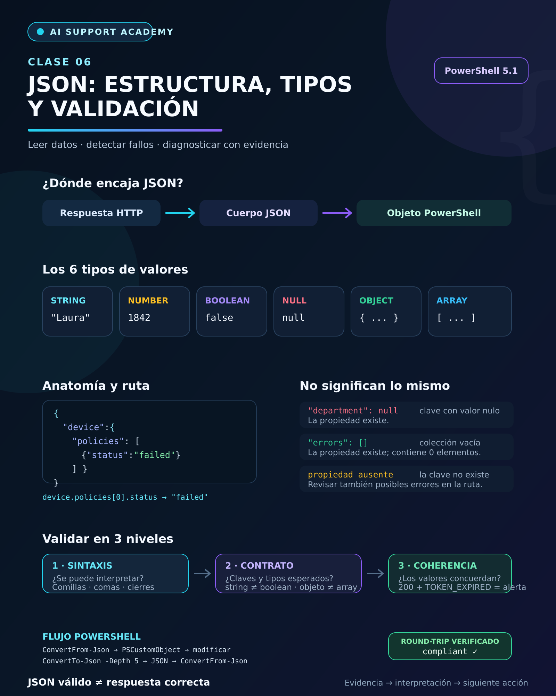

# 🤖 AI Support Academy

# Clase 06 — JSON: estructura, tipos de datos y validación

**Fase:** A2 — HTTP, APIs y JSON
**Duración estimada:** 2–3 horas
**Nivel:** Principiante
**Estado:** Completada ✅
**Fecha:** 4 de septiembre de 2026
**Entorno práctico:** Windows PowerShell 5.1

---

## Objetivo de la clase

Aprender a leer, recorrer, validar y transformar datos JSON para diagnosticar respuestas de una API sin confundir una estructura válida con una respuesta funcionalmente correcta.

Al finalizar esta clase seré capaz de:

- Reconocer objetos, arrays, claves y valores.
- Identificar los tipos de datos disponibles en JSON.
- Acceder a valores dentro de estructuras anidadas.
- Diferenciar `null`, un array vacío y una propiedad inexistente.
- Detectar errores de sintaxis habituales.
- Separar sintaxis, contrato y coherencia lógica.
- Convertir JSON a objetos de PowerShell.
- Modificar un objeto y convertirlo nuevamente a JSON.
- Capturar un error de análisis mediante `try/catch`.
- Formular un diagnóstico técnico basado en evidencias.

---

## 1. De HTTP y REST al cuerpo JSON

En las clases anteriores aprendí que una petición y una respuesta HTTP contienen varias partes:

```text
Método + endpoint + cabeceras + cuerpo
                    ↓
Estado + cabeceras + cuerpo + tiempos
```

JSON suele utilizarse para representar los datos que viajan dentro del cuerpo.

Por tanto:

- HTTP transporta la petición y la respuesta.
- REST propone una forma de organizar recursos y operaciones.
- JSON representa los datos intercambiados.

Ejemplo:

```http
HTTP/1.1 401 Unauthorized
Content-Type: application/json
```

```json
{
  "success": false,
  "error": "TOKEN_EXPIRED",
  "data": null
}
```

El código HTTP real pertenece a la respuesta HTTP. Un campo como `"status_code": 401` dentro del JSON es un dato de la aplicación y debe comprobarse por separado.

---

## 2. ¿Qué es JSON?

JSON significa:

> **JavaScript Object Notation**

Es un formato de texto utilizado para intercambiar y almacenar datos estructurados.

Sus características principales son:

- Es legible para personas.
- Puede ser procesado por programas.
- Es independiente del lenguaje que lo consume.
- Es habitual en APIs, configuraciones, logs y aplicaciones web.

JSON no es una base de datos ni un lenguaje de programación. Es una representación textual de datos.

---

## 3. Elementos básicos

Ejemplo de una respuesta de soporte:

```json
{
  "ticket_id": 1842,
  "status": "open",
  "priority": "high",
  "resolved": false
}
```

Puedo identificar:

| Elemento | Ejemplo | Función |
|---|---|---|
| Objeto | `{ ... }` | Agrupa propiedades |
| Clave | `"status"` | Nombra una propiedad |
| Separador | `:` | Separa la clave de su valor |
| Valor | `"open"` | Contiene el dato |
| Coma | `,` | Separa propiedades o elementos |

Una propiedad completa es una pareja clave–valor:

```json
"status": "open"
```

---

## 4. Tipos de datos JSON

JSON admite seis tipos de valores:

| Tipo | Ejemplo | Interpretación |
|---|---|---|
| String | `"Laura"` | Texto |
| Number | `1842` | Número |
| Boolean | `true` | Verdadero o falso |
| Null | `null` | Valor nulo |
| Object | `{ "id": 27 }` | Conjunto de propiedades |
| Array | `["m365", "login"]` | Lista ordenada de elementos |

Ejemplo combinado:

```json
{
  "ticket_id": 1842,
  "status": "open",
  "tags": ["m365", "login"],
  "resolved": false,
  "assigned_to": null,
  "user": {
    "id": 27,
    "name": "Laura"
  }
}
```

Las comillas cambian el tipo:

```json
false
```

es un booleano, mientras que:

```json
"false"
```

es una cadena de texto.

---

## 5. Objetos

Un objeto está delimitado por llaves `{}` y contiene propiedades.

```json
{
  "id": 27,
  "name": "Laura",
  "active": true
}
```

En una API, un objeto puede representar:

- un usuario;
- un dispositivo;
- un ticket;
- una petición;
- un error;
- una configuración.

Un objeto vacío se representa como:

```json
{}
```

---

## 6. Arrays

Un array está delimitado por corchetes `[]` y contiene una lista ordenada de elementos.

```json
[
  "api",
  "http",
  "json"
]
```

También puede contener objetos:

```json
[
  {
    "id": 1,
    "status": "open"
  },
  {
    "id": 2,
    "status": "closed"
  }
]
```

Un array vacío se representa como:

```json
[]
```

La sintaxis JSON permite mezclar tipos dentro de un array, pero el contrato de una API puede exigir que todos los elementos tengan una estructura determinada.

---

## 7. Objetos y arrays anidados

Una respuesta real suele combinar varios niveles:

```json
{
  "device": {
    "device_id": "LAP-027",
    "managed": true,
    "owner": {
      "name": "Laura",
      "department": null
    },
    "policies": [
      {
        "name": "BitLocker",
        "status": "compliant",
        "errors": []
      },
      {
        "name": "Windows Update",
        "status": "failed",
        "errors": [
          "0x8024402C"
        ]
      }
    ]
  }
}
```

La estructura puede leerse como un árbol:

```text
device
├── device_id
├── managed
├── owner
│   ├── name
│   └── department
└── policies
    ├── [0] BitLocker
    └── [1] Windows Update
        └── errors
            └── [0] 0x8024402C
```

---

## 8. Rutas e índices

Durante la práctica utilicé una notación con puntos para describir dónde se encuentra cada dato:

```text
device.device_id              → LAP-027
device.owner.name             → Laura
device.policies[0].status     → compliant
device.policies[1].status     → failed
device.policies[1].errors[0]  → 0x8024402C
```

Reglas:

1. Ante un objeto, selecciono una clave.
2. Ante un array, selecciono una posición.
3. Los índices comienzan en cero.
4. Continúo hasta alcanzar el valor.

La ruta:

```text
errors.code
```

es incompleta cuando `errors` es un array. Debo seleccionar primero un elemento:

```text
errors[0].code
```

Esta notación es una forma práctica de describir la ubicación. No forma parte del texto JSON.

---

## 9. `null`, vacío e inexistente

Estas tres situaciones son diferentes:

```json
{
  "department": null,
  "errors": [],
  "message": ""
}
```

| Situación | Significado |
|---|---|
| `"department": null` | La propiedad existe y contiene un valor nulo |
| `"errors": []` | La propiedad existe y contiene una lista con cero elementos |
| `"message": ""` | La propiedad existe y contiene una cadena vacía |
| Propiedad ausente | La clave no forma parte del objeto |

Un valor `null` no demuestra por sí solo que la información nunca haya existido. Puede deberse a que no se asignó, no se obtuvo, no se aplica o no está disponible en esa respuesta.

---

## 10. Reglas de sintaxis

Para producir JSON estricto debo recordar:

- Las claves utilizan comillas dobles.
- Los strings utilizan comillas dobles.
- `true`, `false` y `null` se escriben en minúsculas.
- Las propiedades y elementos se separan con comas.
- No se añade una coma después del último elemento.
- Cada llave o corchete abierto debe cerrarse.
- JSON estricto no admite comentarios.

Ejemplo válido:

```json
{
  "device_id": "LAP-027",
  "managed": true,
  "errors": []
}
```

---

## 11. JSON malformado

Ejemplo incorrecto:

```text
{
  'device_id': "LAP-027",
  "managed": True,
  "errors": [
    "0x8024402C",
  ],
}
```

Errores:

1. La clave `device_id` utiliza comillas simples.
2. `True` debe escribirse como `true`.
3. Sobra la coma después de `"0x8024402C"`.
4. Sobra la coma después de cerrar el array.

Versión corregida:

```json
{
  "device_id": "LAP-027",
  "managed": true,
  "errors": [
    "0x8024402C"
  ]
}
```

Otro error probado en PowerShell fue la ausencia de una coma:

```text
{
  "device_id": "LAP-027"
  "managed": true
}
```

---

## 12. Tres niveles de validación

Una validación profesional no termina al comprobar la sintaxis.

### Nivel 1 — Sintaxis

Pregunta:

> ¿El texto puede analizarse como JSON?

Comprueba comillas, comas, llaves, corchetes y literales.

### Nivel 2 — Contrato

Pregunta:

> ¿Las claves, tipos y estructuras coinciden con lo documentado por la API?

Un documento puede ser JSON válido, pero contener `"false"` cuando la API exige el booleano `false`.

### Nivel 3 — Coherencia

Pregunta:

> ¿Los valores tienen sentido entre sí?

Una respuesta con `status_code: 200` y `TOKEN_EXPIRED` contiene una contradicción lógica, aunque sea JSON válido.

Regla operativa:

> **Válido no significa necesariamente correcto.**

---

## 13. Caso de contrato incorrecto

La API esperaba:

| Campo | Tipo esperado |
|---|---|
| `request_id` | String |
| `success` | Boolean |
| `status_code` | Number |
| `errors` | Array de objetos |
| `errors[].retryable` | Boolean |
| `data` | Object o `null` |

Respuesta recibida:

```json
{
  "request_id": "req-2001",
  "success": "false",
  "status_code": 200,
  "errors": {
    "code": "TOKEN_EXPIRED",
    "retryable": "true"
  },
  "data": []
}
```

La sintaxis es válida, pero existen cuatro incumplimientos de tipo:

- `success` es un string, no un booleano.
- `errors` es un objeto, no un array.
- `retryable` es un string, no un booleano.
- `data` es un array, aunque el contrato espera un objeto o `null`.

También existe una contradicción entre `200`, que representa éxito HTTP, y `TOKEN_EXPIRED`, que señala un problema de autenticación.

Versión coherente para un token expirado:

```json
{
  "request_id": "req-2001",
  "success": false,
  "status_code": 401,
  "errors": [
    {
      "code": "TOKEN_EXPIRED",
      "retryable": true
    }
  ],
  "data": null
}
```

Debo comprobar además el código HTTP real, ya que el campo `status_code` forma parte del cuerpo JSON.

---

## 14. Evidencia frente a hipótesis

La primera respuesta de dispositivo mostró:

```text
device_id: LAP-027
managed: true
owner: Laura
BitLocker: compliant
Windows Update: failed
error: 0x8024402C
```

Puedo afirmar que la política Windows Update aparece como fallida y devuelve ese código.

No puedo afirmar todavía la causa raíz ni que sea imposible actualizar todo el sistema operativo. Para ello tendría que interpretar el código, revisar los registros y reproducir el problema.

Diagnóstico inicial correcto:

> El dispositivo LAP-027 aparece gestionado. BitLocker se aplica correctamente, pero Windows Update devuelve estado `failed` y el código `0x8024402C`. Es necesario interpretar el código y revisar los registros de Windows Update para determinar la causa.

---

## 15. Entorno PowerShell utilizado

La versión comprobada fue:

```text
Major  Minor  Build  Revision
-----  -----  -----  --------
5      1      26100  9168
```

En este entorno utilicé `ConvertFrom-Json` y `ConvertTo-Json`.

`Test-Json` no está disponible en Windows PowerShell 5.1 porque se incorporó a PowerShell 6.1. La validación sintáctica se realizó intentando convertir el documento y capturando la excepción.

---

## 16. Crear un string JSON multilínea

PowerShell permite guardar varias líneas en un here-string:

```powershell
$json = @'
{
  "device": {
    "device_id": "LAP-027",
    "managed": true
  }
}
'@
```

Los delimitadores `@'` y `'@` deben respetarse. En Windows PowerShell 5.1, el delimitador de cierre debe comenzar al principio de la línea.

---

## 17. Convertir JSON a un objeto PowerShell

Comando utilizado:

```powershell
$response = $json | ConvertFrom-Json
```

Tipo obtenido:

```powershell
$response.GetType().FullName
```

Resultado:

```text
System.Management.Automation.PSCustomObject
```

Correspondencias observadas:

| JSON | PowerShell |
|---|---|
| Object | `PSCustomObject` |
| Array | Colección de objetos |
| String | `System.String` |
| Boolean | `System.Boolean` |
| `null` | `$null` |

---

## 18. Acceder a propiedades y arrays

Consultas ejecutadas:

```powershell
$response.device.device_id
$response.device.managed
$response.device.owner.name
$response.device.owner.department
$response.device.policies[1].status
$response.device.policies[1].errors[0]
```

Resultados:

```text
LAP-027
True
Laura
[sin salida porque el valor es $null]
failed
0x8024402C
```

También generé una vista resumida:

```powershell
$response.device.policies | Select-Object name, status
```

```text
name           status
----           ------
BitLocker      compliant
Windows Update failed
```

---

## 19. La trampa de una propiedad mal escrita

Durante la práctica escribí:

```powershell
$response.devide.device_id
```

En lugar de:

```powershell
$response.device.device_id
```

La primera consulta no produjo salida. Esto podía confundirse con un valor nulo.

Comprobé la existencia de las propiedades:

```powershell
$response.device.owner.PSObject.Properties.Name -contains "department"
# True

$response.PSObject.Properties.Name -contains "devide"
# False
```

Lección:

> Una salida vacía no basta para concluir que una propiedad contiene `null`; también debo comprobar que la propiedad exista y que la ruta esté bien escrita.

---

## 20. Validar un JSON malformado con `try/catch`

JSON utilizado:

```powershell
$invalidJson = @'
{
  "device_id": "LAP-027"
  "managed": true
}
'@
```

Validación compatible con PowerShell 5.1:

```powershell
try {
    $null = $invalidJson | ConvertFrom-Json -ErrorAction Stop
    Write-Host "JSON VALIDO" -ForegroundColor Green
}
catch {
    Write-Host "JSON INVALIDO" -ForegroundColor Red
    Write-Host $_.Exception.Message
}
```

Resultado observado:

```text
JSON INVALIDO
Se ha pasado un objeto no válido. Se esperaba ':' o '}'.
```

El mensaje señala el lugar donde el analizador dejó de comprender el documento. La revisión humana confirmó que faltaba una coma entre las propiedades.

---

## 21. Modificar el objeto

Simulé la recuperación de Windows Update:

```powershell
$response.device.policies[1].status = "compliant"
$response.device.policies[1].errors = @()
```

Resultado:

```text
name           status
----           ------
BitLocker      compliant
Windows Update compliant
```

`@()` representa un array vacío en PowerShell.

---

## 22. Convertir el objeto nuevamente a JSON

Comando utilizado:

```powershell
$response | ConvertTo-Json -Depth 5
```

El parámetro `-Depth 5` permite incluir suficientes niveles de objetos anidados. El valor predeterminado de `ConvertTo-Json` es 2, por lo que una profundidad insuficiente puede degradar o truncar la representación de niveles internos.

Los espacios y saltos de línea son de presentación. Estas dos representaciones tienen el mismo significado:

```json
"errors": []
```

```json
"errors": [

]
```

---

## 23. Comprobación de ida y vuelta

Finalmente ejecuté:

```powershell
$finalJson = $response | ConvertTo-Json -Depth 5 -Compress
$check = $finalJson | ConvertFrom-Json
$check.device.policies[1].status
```

Resultado:

```text
compliant
```

La prueba confirmó el recorrido:

```text
JSON
  ↓ ConvertFrom-Json
PSCustomObject
  ↓ modificación
PSCustomObject actualizado
  ↓ ConvertTo-Json -Depth 5
JSON
  ↓ ConvertFrom-Json
PSCustomObject con estado compliant
```

---

## 24. Diagnóstico técnico final

Caso analizado:

```text
request_id: req-2001
status_code: 401
error: TOKEN_EXPIRED
data: null
```

Diagnóstico redactado:

> La solicitud `req-2001` ha fallado con el código `401` y el error `TOKEN_EXPIRED`. El token de autenticación ha expirado, por lo que se debe renovar o iniciar sesión nuevamente antes de repetir la petición.

Estructura utilizada:

```text
Qué ocurrió + evidencia + siguiente acción
```

---

## 25. Evaluación de conocimientos

La clase incluyó ejercicios de:

- identificación de tipos;
- navegación por objetos y arrays;
- corrección de rutas;
- distinción entre `null`, `[]` y propiedad inexistente;
- corrección de JSON malformado;
- clasificación de documentos válidos e inválidos;
- análisis de contrato y coherencia;
- diagnóstico técnico.

Resultados:

```text
Primera lectura de tipos y rutas: 4/5
Corrección de JSON malformado: correcta
Clasificación inicial de ejemplos: 3/4 + recuperación correcta
Laboratorio PowerShell: completado
Comprobación de ida y vuelta: compliant
Contrato y coherencia: recuperación guiada completada
Diagnóstico final: correcto
```

**Evaluación superada tras recuperación guiada ✅**

---

## 26. Evidencia visual



---

## 27. Laboratorio reproducible

El laboratorio completo está disponible en:

[`A2-02-JSON-Diagnostic-Lab`](../laboratorios/A2-02-JSON-Diagnostic-Lab/README.md)

Incluye:

- JSON válido de gestión de dispositivos;
- JSON malformado intencionalmente;
- JSON sintácticamente válido que incumple el contrato;
- respuesta corregida para `TOKEN_EXPIRED`;
- script de validación compatible con PowerShell 5.1;
- evidencias de conversión, validación y comprobación de ida y vuelta.

---

## 28. Competencias adquiridas y estado final

Después de completar esta clase puedo:

- Leer una respuesta JSON de forma ordenada.
- Reconocer todos los tipos de datos JSON.
- Navegar por objetos y arrays anidados.
- Interpretar rutas e índices.
- Diferenciar un valor nulo, una lista vacía y una propiedad ausente.
- Detectar errores sintácticos habituales.
- Separar validez sintáctica, contrato y coherencia.
- Utilizar PowerShell para convertir y examinar JSON.
- Capturar un fallo de análisis.
- Modificar y volver a serializar datos anidados.
- Verificar una conversión de ida y vuelta.
- Redactar un diagnóstico sin afirmar una causa no demostrada.

```text
Clase 06: completada
Evaluación: superada tras recuperación guiada
Laboratorio PowerShell 5.1: completado
JSON malformado: detectado
Round-trip: compliant
Infografía: creada
```

### Clase 06 superada ✅

---

## Referencias

- [RFC 8259 — The JavaScript Object Notation (JSON) Data Interchange Format](https://www.rfc-editor.org/rfc/rfc8259)
- [Microsoft Learn — ConvertFrom-Json](https://learn.microsoft.com/powershell/module/microsoft.powershell.utility/convertfrom-json)
- [Microsoft Learn — ConvertTo-Json](https://learn.microsoft.com/powershell/module/microsoft.powershell.utility/convertto-json)
- [Microsoft Learn — Test-Json](https://learn.microsoft.com/powershell/module/microsoft.powershell.utility/test-json)

---

## Próximo paso

### Clase 07 — Postman y diagnóstico de peticiones

En la siguiente clase aprenderé:

- Cómo organizar peticiones en Postman.
- Cómo configurar métodos, endpoints y cabeceras.
- Cómo enviar cuerpos JSON.
- Cómo utilizar variables.
- Cómo inspeccionar códigos, cuerpos y tiempos.
- Cómo documentar y reproducir errores de autenticación, ruta y límite de peticiones.
